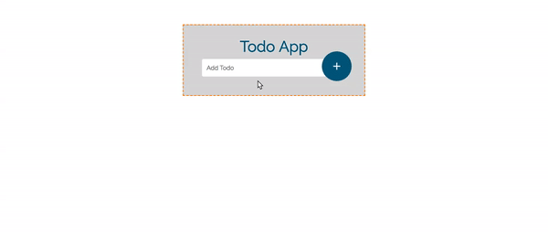

# Todo App

__This Angular app allows users to create a todo list and delete items from the list upon completion__

#### __Overview:__

* This application utilizes Node.js, NPM and Angular-CLI
* Angular-CLI created and generated the components, services, router and directives for the app
* Users can add an item to the list _(submitting a form in Angular)_
* Users can also delete any item from the list _(adding an event in Angular)_

#

