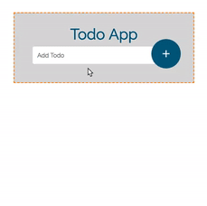

# Todo App

#### __Overview:__

* This application utilized node.js, npm, and Angular-CLI

* Angular-CLI created and generated the components within this app. It also generated the services, router and directives. 

* A user can add an item to the list _(submitting a form in Angular)_

* A user can also delete an item from the list _(adding an event in Angular)_

#

